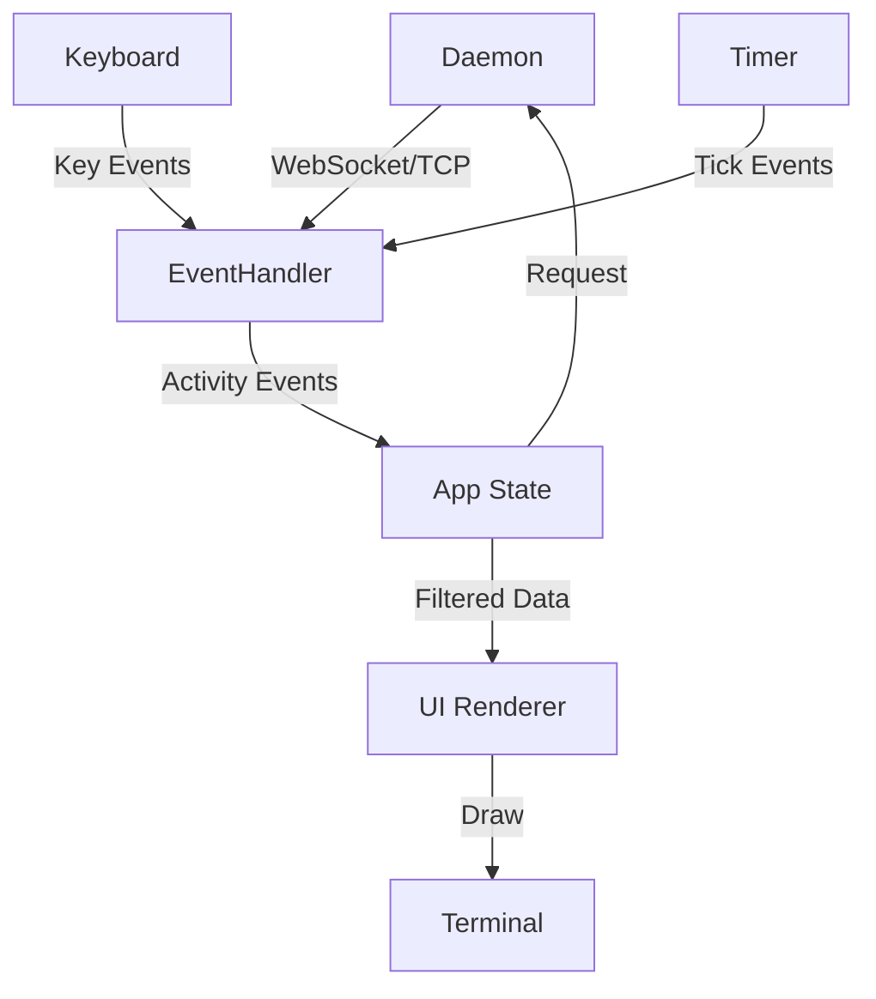

# Ratatui Context Watch Mode Architecture

## Overview

This document outlines the architecture for refactoring Port42's context watch mode to use Ratatui, a modern TUI (Terminal User Interface) framework for Rust. The new implementation will provide a rich, interactive terminal interface similar to tools like `htop`, `k9s`, or `lazygit`.

## Directory Structure

```
cli/src/context/
├── mod.rs              # Module exports
├── formatters.rs       # Keep existing formatters for non-TUI modes
├── watch.rs           # Refactor to orchestrate TUI
└── tui/               # New TUI components
    ├── mod.rs         # TUI module exports
    ├── app.rs         # Main TUI application state
    ├── ui.rs          # UI rendering logic
    ├── events.rs      # Event handling (keyboard, timer)
    ├── widgets/       # Custom widgets
    │   ├── mod.rs
    │   ├── activity_table.rs  # Scrollable activity table
    │   ├── header.rs          # Header with stats
    │   └── footer.rs          # Footer with keybinds
    └── state.rs       # Application state management
```

## Core Components

### 1. Application State (`tui/app.rs`)

The central state manager for the TUI application:

```rust
pub struct App {
    // Activity management
    activities: Vec<ActivityRecord>,
    filtered_activities: Vec<ActivityRecord>,
    max_activities: usize,  // Ring buffer size (e.g., 1000)
    
    // UI state
    selected_index: usize,
    scroll_offset: usize,
    viewport_height: usize,
    
    // Filtering
    filter_mode: FilterMode,
    filter_text: String,
    is_filtering: bool,
    
    // View options
    show_details: bool,
    auto_scroll: bool,
    show_timestamps: bool,
    
    // Stats
    total_commands: usize,
    commands_per_minute: f64,
    active_session: Option<String>,
    last_refresh: Instant,
    
    // Connection
    daemon_client: DaemonClient,
}

pub enum FilterMode {
    All,
    Commands,
    Memory,
    FileAccess,
    ToolUsage,
    Search(String),
}
```

### 2. Event System (`tui/events.rs`)

Handles all user input and timer events:

```rust
pub enum Event {
    // Keyboard events
    Key(KeyEvent),
    
    // Timer events
    Tick,           // Refresh from daemon
    
    // Terminal events
    Resize(u16, u16),
    
    // Application events
    NewActivity(ActivityRecord),
    ConnectionLost,
}

pub struct EventHandler {
    rx: mpsc::Receiver<Event>,
    tick_rate: Duration,
}

// Key mappings
// q        - Quit
// f        - Cycle filter mode
// /        - Search mode
// ↑/k      - Move up
// ↓/j      - Move down
// PgUp/u   - Page up
// PgDn/d   - Page down
// Home/g   - Go to top
// End/G    - Go to bottom
// Space    - Toggle details
// a        - Toggle auto-scroll
// t        - Toggle timestamps
// c        - Clear activities
// r        - Force refresh
// ?        - Show help
```

### 3. UI Layout (`tui/ui.rs`)

The main rendering logic with responsive layout:

```
┌──────────────────────────────────────────────────────────┐
│ 🔍 Port42 Context Monitor │ 247 activities │ 12.3 cmd/m │ <- Header
├──────────────────────────────────────────────────────────┤
│ Time     Type      Activity              Details          │
│ ──────────────────────────────────────────────────────── │
│ 12:34:56 COMMAND   port42 status         ✓ Success       │ <- Scrollable
│ 12:34:50 MEMORY    Created session       cli-xxx         │    Activity
│ 12:34:45 ACCESS    Read /tools/          15 items        │    Table
│ 12:34:40 TOOL      git-haiku             Generated haiku │
│ 12:34:35 COMMAND   port42 possess @ai    Interactive     │
│ 12:34:30 FILE      Modified context.go   +45 -12         │
│ ...                                                       │
├──────────────────────────────────────────────────────────┤
│ [q]uit [f]ilter [/]search [↑↓]nav [space]details [?]help│ <- Footer
└──────────────────────────────────────────────────────────┘
```

Layout zones:
- **Header**: 3 lines - Title, stats, separator
- **Body**: Terminal height - 7 lines - Activity table
- **Footer**: 3 lines - Separator, keybinds, bottom border

### 4. Activity Table Widget (`widgets/activity_table.rs`)

A custom widget for the activity list:

```rust
pub struct ActivityTable {
    activities: Vec<ActivityRecord>,
    selected: Option<usize>,
    offset: usize,
    show_details: bool,
    highlight_style: Style,
}

impl Widget for ActivityTable {
    fn render(self, area: Rect, buf: &mut Buffer) {
        // Render visible rows with virtualization
        // Color coding by activity type
        // Expandable detail view
    }
}

// Color scheme
// COMMAND  - Blue
// MEMORY   - Green  
// ACCESS   - Cyan
// TOOL     - Magenta
// FILE     - Yellow
// ERROR    - Red
```

### 5. Header Widget (`widgets/header.rs`)

Displays current stats and status:

```rust
pub struct Header {
    title: String,
    activity_count: usize,
    commands_per_minute: f64,
    filter_mode: FilterMode,
    connected: bool,
}

// Shows:
// - Connection status (green dot if connected)
// - Total activities in buffer
// - Command rate
// - Active filter
// - Current time
```

### 6. Footer Widget (`widgets/footer.rs`)

Shows available keyboard shortcuts:

```rust
pub struct Footer {
    keybinds: Vec<(String, String)>,
    show_extended: bool,
}

// Contextual keybinds based on current mode
// Changes when in search mode, filter mode, etc.
```

## Data Flow



## Implementation Phases

### Phase 1: Basic TUI Structure
1. Add Ratatui dependencies
2. Create basic app skeleton
3. Implement terminal setup/teardown
4. Basic event loop

### Phase 2: Activity Display
1. Implement activity table widget
2. Add scrolling support
3. Color coding by type
4. Basic keyboard navigation

### Phase 3: Filtering & Search
1. Implement filter modes
2. Add search functionality
3. Real-time filtering
4. Persist filter preferences

### Phase 4: Advanced Features
1. Activity details expansion
2. Export functionality
3. Activity replay
4. Performance graphs

### Phase 5: Polish
1. Smooth scrolling animations
2. Help overlay
3. Configuration file support
4. Themes

## Dependencies

```toml
[dependencies]
ratatui = "0.26"
crossterm = "0.27"
tokio = { version = "1", features = ["full"] }
tui-textarea = "0.4"  # For search input
anyhow = "1.0"
chrono = "0.4"
```

## Performance Considerations

1. **Virtual Scrolling**: Only render visible rows
2. **Ring Buffer**: Limit activity history (e.g., 1000 items)
3. **Debounced Updates**: Batch updates every 100ms
4. **Lazy Rendering**: Only redraw changed sections
5. **Background Polling**: Async daemon communication

## Error Handling

- Graceful degradation if terminal doesn't support colors
- Reconnection logic for daemon connection loss
- Fallback to simple mode if TUI fails
- Proper panic handler to restore terminal

## Testing Strategy

1. **Unit Tests**: Widget rendering, state management
2. **Integration Tests**: Event handling, data flow
3. **Terminal Tests**: Different terminal emulators
4. **Performance Tests**: Large activity volumes
5. **Accessibility Tests**: Screen reader compatibility

## Future Enhancements

- **Split Panes**: Multiple activity views
- **Activity Graphs**: Visualize patterns over time
- **Export Formats**: CSV, JSON, Markdown
- **Remote Monitoring**: Connect to remote Port42 instances
- **Activity Replay**: Step through historical activities
- **Custom Themes**: User-defined color schemes
- **Plugins**: External activity processors

## References

- [Ratatui Documentation](https://ratatui.rs/)
- [Ratatui Examples](https://github.com/ratatui-org/ratatui/tree/main/examples)
- [k9s Architecture](https://github.com/derailed/k9s) - Similar TUI patterns
- [lazygit UI](https://github.com/jesseduffield/lazygit) - Excellent keyboard UX