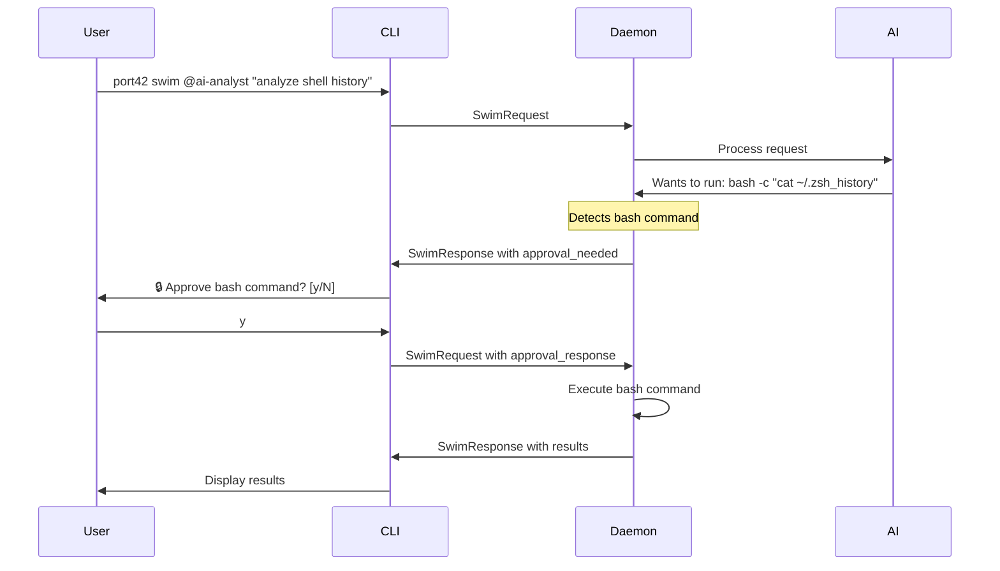

# Bash Command Approval System

## Overview
Implement user approval for bash commands executed by AI agents during swim sessions, maintaining security while preserving the power of bash for complex operations.

## Problem Statement
- AI agents need bash for complex shell operations (pipelines, conditionals)
- Giving unrestricted bash access is a security risk
- Daemon runs in background and can't directly prompt user
- But CLI-daemon communication channel exists and can be leveraged

## Solution Architecture

### Core Concept
Integrate approval flow into existing swim request/response cycle:
1. Daemon detects bash command needs approval
2. Returns partial response with approval request
3. CLI prompts user interactively
4. Sends continuation with approval decision
5. Daemon completes or aborts based on decision

### Protocol Design

#### 1. SwimResponse Enhancement (daemon → CLI)
```go
// daemon/src/protocol.go
type SwimResponse struct {
    Output       string                `json:"output"`
    SessionID    string                `json:"session_id,omitempty"`
    ApprovalNeeded *ApprovalRequest    `json:"approval_needed,omitempty"`
}

type ApprovalRequest struct {
    Command     string   `json:"command"`      // "bash"
    Args        []string `json:"args"`         // ["-c", "..."]
    RequestID   string   `json:"request_id"`   // Unique ID for this request
}
```

#### 2. SwimRequest Enhancement (CLI → daemon)
```rust
// cli/src/protocol/swim.rs
pub struct SwimRequest {
    pub agent: String,
    pub prompt: String,
    pub session: Option<String>,
    pub references: Vec<String>,
    pub approval_response: Option<ApprovalResponse>, // NEW
}

pub struct ApprovalResponse {
    pub request_id: String,
    pub approved: bool,
}
```

### State Management

#### Daemon Side
```go
// daemon/src/swimming.go

type PendingApproval struct {
    RequestID    string
    Command      string
    Args         []string
    Context      context.Context
    ResultChan   chan ApprovalResult
    SessionID    string
}

type ApprovalResult struct {
    Approved bool
}

// Global map to track pending approvals
var pendingApprovals = sync.Map{} // requestID -> *PendingApproval
```

#### CLI Side
```rust
// cli/src/swim.rs

struct ApprovalContext {
    request_id: String,
    session_id: String,
    command: String,
    args: Vec<String>,
}
```

### Flow Sequence



### Implementation Details

#### 1. Daemon: Detect and Request Approval
```go
// swimming.go - in executeCommand()

if params.Command == "bash" {
    // Generate unique request ID
    requestID := fmt.Sprintf("bash-%d", time.Now().UnixNano())
    
    // Create pending approval
    pending := &PendingApproval{
        RequestID:  requestID,
        Command:    params.Command,
        Args:       params.Args,
        Context:    ctx,
        ResultChan: make(chan ApprovalResult, 1),
        SessionID:  sessionID,
    }
    
    pendingApprovals.Store(requestID, pending)
    
    // Return approval request to CLI
    return SwimResponse{
        Output: "🔒 AI requests permission to execute bash command",
        SessionID: sessionID,
        ApprovalNeeded: &ApprovalRequest{
            Command:   "bash",
            Args:      params.Args,
            RequestID: requestID,
        },
    }
}
```

#### 2. CLI: Prompt User
```rust
// client.rs - in handle_swim_response()

if let Some(approval) = response.approval_needed {
    // Format the command for display
    let cmd_display = format_bash_command(&approval.args);
    
    // Show approval prompt
    println!("{}",  "=".repeat(60));
    println!("🔒 AI REQUESTS BASH ACCESS");
    println!("{}",  "-".repeat(60));
    println!("Command: {}", style(&cmd_display).cyan());
    println!("{}",  "-".repeat(60));
    println!("⚠️  Bash commands have full system access");
    println!("{}",  "=".repeat(60));
    
    // Get user input
    print!("Approve? [y/N]: ");
    io::stdout().flush()?;
    
    let approval_response = read_user_approval()?;
    
    // Send continuation with approval
    let continued_request = SwimRequest {
        agent: original.agent,
        prompt: "", // Empty prompt for continuation
        session: Some(response.session_id),
        references: vec![],
        approval_response: Some(ApprovalResponse {
            request_id: approval.request_id,
            approved: approval_response.approved,
        }),
    };
    
    // Send and handle continued response
    send_swim_request(continued_request)?;
}
```

#### 3. Daemon: Handle Approval Response
```go
// server.go - in handleSwimRequest()

if req.ApprovalResponse != nil {
    // Look up pending approval
    if pending, ok := pendingApprovals.LoadAndDelete(req.ApprovalResponse.RequestID); ok {
        p := pending.(*PendingApproval)
        
        // Send result to waiting goroutine
        p.ResultChan <- ApprovalResult{
            Approved: req.ApprovalResponse.Approved,
        }
        
        // Continue the swim session
        return continueSwimSession(p.SessionID)
    }
}
```

### Security Considerations

For Phase 1, we simply:
- Show the full bash command to the user
- Require explicit approval for each bash command
- No automatic approvals or risk assessment

### User Experience

#### Approval Options (Simplified)
- **y/yes**: Approve this command
- **n/no**: Deny this command (default)

#### Display Formatting (Simplified)
```
============================================================
🔒 AI REQUESTS BASH ACCESS
------------------------------------------------------------
Command: bash -c "cat ~/.zsh_history | grep port42"
------------------------------------------------------------
⚠️  Bash commands have full system access
============================================================
Approve? [y/N]: 
```

### Testing Plan (Simplified)

1. **Basic Approval Flow**
   - AI requests bash command
   - User approves
   - Command executes
   - Results returned

2. **Denial Flow**
   - AI requests bash command
   - User denies
   - Appropriate error returned to AI
   - AI adapts approach

3. **Edge Cases**
   - Multiple bash commands in sequence
   - Session recovery after daemon restart

### Future Enhancements

1. **Persistent Approval Rules**
   - Save approved patterns to config
   - User-defined trust rules
   - Per-agent trust levels

2. **Audit Logging**
   - Log all bash executions
   - Track approvals/denials
   - Generate security reports

3. **Sandboxing Options**
   - Run bash in restricted shell
   - Use Docker/VM for isolation
   - Limit filesystem access

4. **Smart Approvals**
   - Auto-approve read-only operations
   - Require double confirmation for destructive
   - Context-aware risk assessment

## Implementation Order (Simplified Scope)

### Phase 1: Core Approval Flow (Current)
1. Add protocol types to daemon (protocol.go)
2. Implement approval detection in daemon (swimming.go)
3. Add approval response handling in daemon (server.go)
4. Add protocol types to CLI (protocol/swim.rs)
5. Implement approval prompt in CLI (client.rs)
6. Test complete flow

### Phase 2: Future Enhancements (Not in current scope)
- Risk assessment
- Remember functionality
- Persistent approval rules
- Audit logging